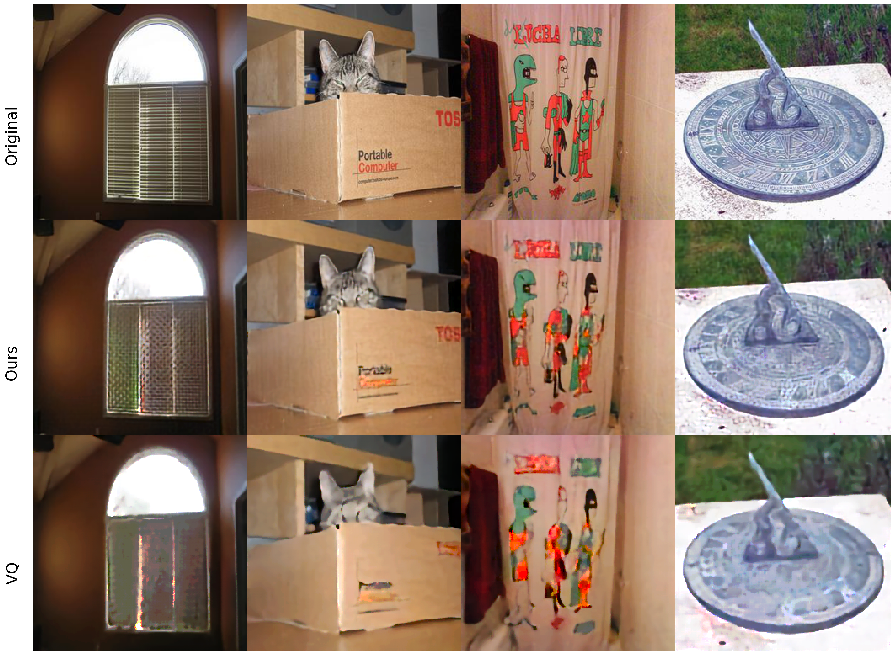

# Depthwise Neural Discrete Representation Learning

Vector Quantized Variational Autoencoders (VQVAE) have produced remarkable results in multiple domains. VQVAE learns a prior distribution ze along with its mapping to a discrete number of K vectors (Vector Quantization). We propose applying VQ along the feature axis. We hypothesize that by doing so, we are learning a mapping between the codebook vectors and the marginal distribution of the prior feature space. Our approach leads to 33% improvement as compared to prevous discrete models and has similar performance to state of the art auto-regressive models (e.g. PixelSNAIL). 

## Examples

 

## Replication

For exact benchmarks as reported in the paper please see branch [tf1](https://github.com/fostiropoulos/dvq/tree/tf1). Training for [DVQ](https://github.com/fostiropoulos/dvq/blob/tf1/CIFAR10_DVQ.ipynb), final train loss 2.163272 as compared to [VQVAE](https://github.com/fostiropoulos/dvq/blob/tf1/CIFAR10_VQ.ipynb) 3.2411757

## Note 

Current training and evaluation for TF2 is in master branch [Results](https://github.com/fostiropoulos/dvq/blob/master/VQVAE%20vs%20DVQVAE.ipynb) It still requires additional fine-tuning and architectural changes to achieve same results as in TF1. 

## TODO: 
- [ ] Evalaute learned prior on conditioned PixelCNN and PixelCNN++
